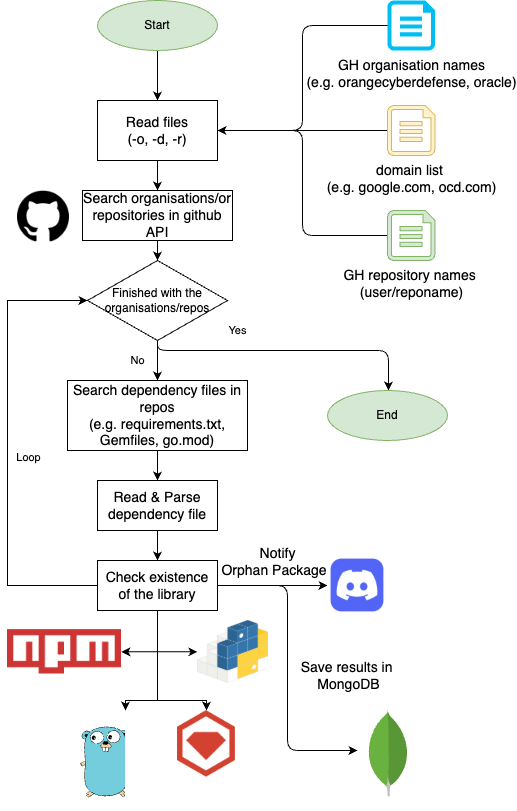
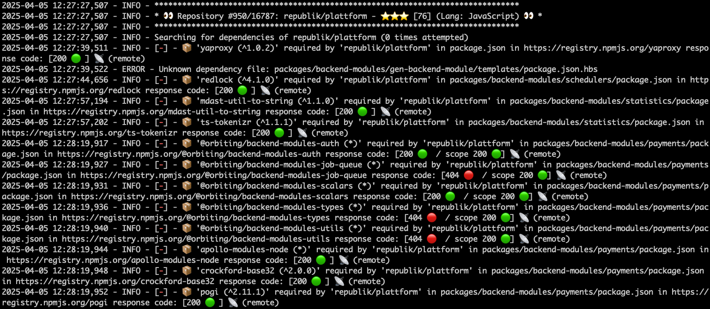
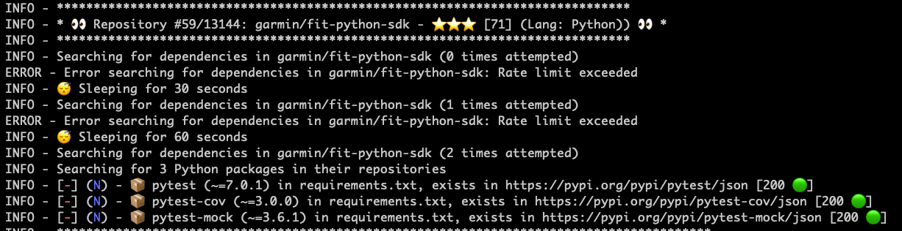
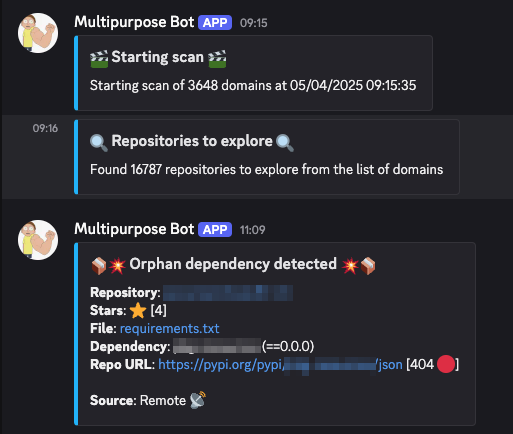
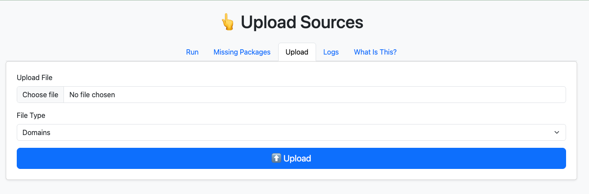
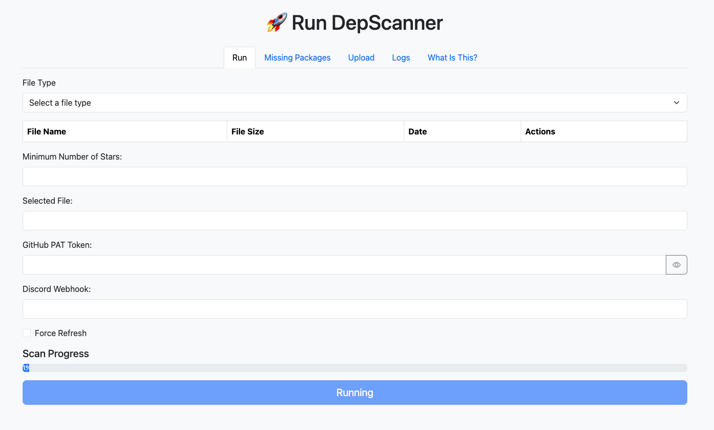
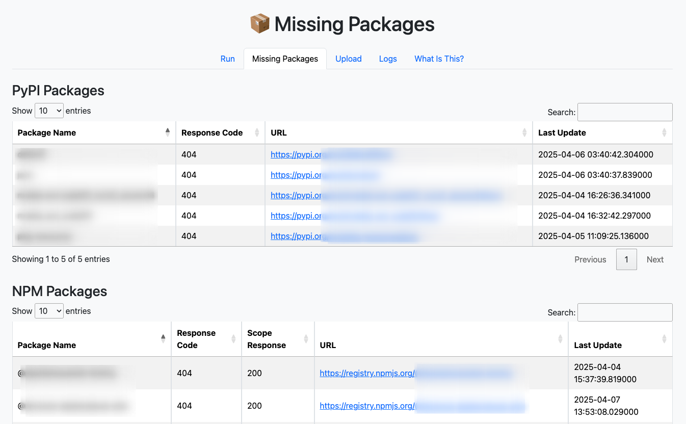

# Depscanner

## Summary
This tool's purpose is to detect public repository dependencies in github of some organisations with an orphan required library. This is, the library does not exists in public repositories for that language. For example, a github project may define a requirements.txt with a package name 'internal-package'. This tool will loop throught the public projects in each organisation tyring to find the library requirements definition file appropriate to that language. Then, it will try to search for that package in their repo, for example, for Python packages, it will search in pypi.org, or for Golang it will search the package in "pkg.go.dev".

There are two ways to use it: the CLI or the Web interface. But first, you need to install the tool. 
It requires a mongodb database to store the results, so the best approach is to run the infrastructure with docker compose. 

# Workflow

The tool receives as an input a list of organisation names, domain names, or repository names (orgname/reponame). It lists the repositories of the organisation via GitHub API and tries to find wether the repository has a well-known dependency file, such as requirements.txt, Pipenv, Gemfile, go.mod, package.json, etc. Then, parses the file and list each library/module that this repository needs to work. It will access to the public package registries and find wether that library exists or not.

If the library does not exits, it will optionally notify you to your discord channel via a webhook and save the result in a database:



# Setup

## Using Docker Compose

To boot the tool for the first time, you can just launch the script `./launch.sh`.
Alternatively, you can install by issuing the command (**Disclaimer**: Please, change the Mongo database password):
```bash
git clone https://github.com/sensepost/depscanner
cd depscanner
./launch.sh

# ===========
# Or alternatively execute docker compose manually:
MONGODB_PASSWD=Test123 docker compose up -d # or execute ./launch.sh

# ===========
# Or use an .env file if you are using Windows
echo 'MONGODB_PASSWD=Test123' > .env
docker compose up -d
```

After the infrastructure is deployed, you can run the CLI like this:

```bash
# Get the help
docker exec -it depscanner-web depscanner -h
usage: usage: depscan.py [-h] (-d DOMAINS | -o ORGS | -r REPOS) [-s STARS] [-t TOKEN] [-P PROXY] [-W WEBHOOK] [-F] [-L {DEBUG,INFO,WARNING,ERROR,CRITICAL}]

Find missing dependencies in Python, JavaScript, TypeScript, Ruby, and Golang projects

optional arguments:
  -h, --help            show this help message and exit
  -s STARS, --stars STARS
                        Filter the repositories by the number of stars (default: 0)
  -t TOKEN, --token TOKEN
                        GitHub PAT token for the API
  -P PROXY, --proxy PROXY
                        Proxy for HTTP connections (debugging purposes)
  -W WEBHOOK, --webhook WEBHOOK
                        Discord webhook to receive missing packages details
  -F, --force           Force query GitHub and repositories API to refresh the database (default: False)
  -L {DEBUG,INFO,WARNING,ERROR,CRITICAL}, --level {DEBUG,INFO,WARNING,ERROR,CRITICAL}
                        Log level

sources:
  Files containing domains, organisations names or repository names

  -d DOMAINS, --domains DOMAINS
                        File containing domain names
  -o ORGS, --orgs ORGS  File containing GitHub organisation names
  -r REPOS, --repos REPOS
                        File containing GitHub repository names

# Run a 
```

## From requirements.txt (not recommended):
If you know what you are doing and want to use your own mongo db, modify the "mongo" section of the config.yml file to connect to your database. 
Then, you can install the requirements of the tool:
```bash
pip install -r requirements.txt
```

If you have your own Mongo instance and configured correctly the file "config.yml", you can use the CLI now and the results should be saved in your own database. 

Optionally, if you want to start the web interface, execute:
```
cd web
flask run --port 8015
```

## CLI
If you installed the tool via `docker compose up -d`, you can run the CLI like this (providing your own list of domains to scan):
```bash
mkdir mylists
cp mydomains.txt mylists/
docker run -v $(PWD)/mylists:/app/mylists --rm -it depscanner-web depscanner -t <yourtoken> -d mylists/mydomains.txt -W <discord webhook>
```

The only mandatory flags are:
* The input file, which can be a domain list (`-d`), an organisation name list (`-o`), or a list of GitHub repositories (`-r`)
* A GitHub PAT token to access their API (It can work without a GitHub PAT, but the rate limiting is much more strict)

You can specify organisation names instead of domains with the flag `-o`, instead of `-d`.
If  you want to explore a list of github repositories instead, you can use the flag `-r`.

The results will be stored in an Mongo database. It can be accessed via the `mongosh` or Mongo Express interface available at http://localhost:8081/ (if you ran it via docker compose up). 

The terminal will present the information about the status of the scan:



Depscanner will report the package as missing if it finds a 404 response. 
It will backoff for some time if it finds a 429 Rate Limit Exceeded response:


Optionally, you can provide a webhook to Discord with the flag `-W` to receive notifications of orphan packages.


For debugging purposes, you can also specify an HTTP proxy to send the request through with the parameter `-P`.

To speed up the analysis and reduce the number of times you hit a Rate Limit on GitHub's API, you can filter the repositories to analyse by number of stars with the parameter `-s <number>`. Any repository with less stars than <number> will not be analysed.

## Web Interface
The web interface is based in python's Flask package.

If you installed the tool by using `launch.sh` or `mongo compose`, the web interface should already be running in http://localhost:8015/. 

If you installed this tool manually via requirements.txt (not recommended), you have to launch the web interface manually like this:
```
# Go to the web folder and launch flask server
cd web && flask run --port 8015
# Or running the script:
./web.sh
```

Once you have the application running access http://localhost:8015.
You will have to upload your domain/organisation/repositories list source file from the "Upload" tab. 
Select the type of file you are uploading and your file:



Once you have uploaded the source, go to "Run" and provide your GitHub PAT token and optionally a Discord webhook to receive notifications during the scan:



Depending on the size of the input, the scan will take long time. You can check the logs of the running scan in "Logs".
Once the scans are finished, you can check the orphan packages in the tab "Missing packages":



## Caching Capabilities

Due to GitHub API strict rate limit, the tool has been programmed to avoid any unecessary request to GitHub API or the public registries (e.g. npmjs.org, pypi.org). For that, it uses a MongoDB where it stores the repository information recently retrieved from GitHub and the package/dependency information from the registries. If the repository or package you want to analyse is already in the local database, the tool will use the information from the database instead of sending an HTTP request.

The information stored in the local database is refreshed frequently. The refresh rate depends on the hours specified in the `config.yml` file. The attribute `db_refresh_hours` specify when the data is considered outdated and should be retrieved again from the GitHub API or public registries. Each document in the database has an `updated` attribute used to compare today's date with when this document was updated the last time. Then, the application takes the decision on whether download/refresh the data or not.

If you want to see the information stored in the MongoDB, navigate to http://localhost:8081/, where a Mongo Express should be listening.
